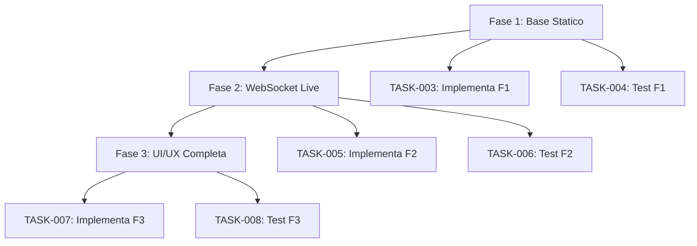

# Piano Implementativo: AgentStatusPanel — Fasi 1-3

## 1. Contesto
Derivato da `TASK-001` (specifica dashboard) e `TASK-002` (richiesta suddivisione).
Obiettivo: piano ordinarello scomporre la dashboard in 3 fasi implementative testabili indipendentemente, pronte per TASK-003 (F1) e TASK-004 (test F1).

---

## 2. Panoramica Fasi

| Fase | Nome | Scope Principale | Dipende Da | Test Minimo |
|------|------|------------------|------------|-------------|
| **F1** | Base Statico | Componente React, mock data, rendering 5 agenti | — | Unit test: render + conteggio stati |
| **F2** | WebSocket Live | Connessione WS, auto-reconnect, heartbeat, aggiornamento stati | F1 | Integration test: mock WS → aggiornamento <500ms |
| **F3** | UI/UX Completa | Tailwind styling, animazioni, accessibilità (ARIA), responsive | F2 | Visual regression + a11y audit |

---

## 3. Dettaglio per Fase

### FASE 1 — Componente Base + Mock Data + Rendering Statico

**Obiettivo**: Componente `AgentStatusPanel` funzionante con dati statici.

**Input**
- Specifica `docs/deliverable-TASK-001.md`
- Mock data (5 agenti: DG, Coordinatore, Executor, Tester, Reviewer)
- Interfacce TypeScript: `AgentStatus`, `AgentStatusPanelProps`

**Output**
- `src/components/AgentStatusPanel.tsx`
- `src/components/AgentStatusPanel.test.tsx`
- Mock data inline o in `src/data/mockAgents.ts`

**Dipendenze**: Nessuna (entry point)

**Criteri di Test Minimi**
1. **Render test**: Componente monta senza errori
2. **Count test**: 5 card agenti renderizzate
3. **State display test**: Ogni card mostra nome, ruolo, stato colorato
4. **TypeScript**: `npm run typecheck` → 0 errori
5. **Coverage**: > 80% statements

**File da Creare**
```
src/
├── components/
│   ├── AgentStatusPanel.tsx
│   └── AgentStatusPanel.test.tsx
└── data/
    └── mockAgents.ts
```

**Criteri Accettazione F1**
- [ ] Componente compila TypeScript strict
- [ ] Renderizza 5 agenti con mock data
- [ ] Stati colorati: verde=ACTIVE, giallo=BUSY, rosso=ERROR, grigio=IDLE
- [ ] Unit test passano (min 3 test)
- [ ] Nessuna dipendenza WebSocket in questa fase

---

### FASE 2 — Integrazione WebSocket Reale + Auto-Reconnect + Heartbeat

**Obiettivo**: Sostituire mock data con flusso live via WebSocket nativo.

**Input**
- Componente F1 funzionante
- WebSocket URL (es. `ws://localhost:8000/ws`)
- Protocollo messaggi: `{ agentId, state, timestamp }`

**Output**
- `AgentStatusPanel.tsx` aggiornato con hook `useWebSocket`
- `src/hooks/useAgentWebSocket.ts` (logica WS isolata)
- Gestione stati: `connecting`, `connected`, `disconnected`, `reconnecting`

**Dipendenze**: F1 completata (PASS)

**Criteri di Test Minimi**
1. **Connection test**: WebSocket apre connessione su URL valido
2. **Message test**: Messaggio mock → aggiorna stato agente corretto
3. **Latency test**: Aggiornamento stato < 500ms da ricezione messaggio
4. **Reconnect test**: Chiudi socket → auto-reconnect entro 3s (max 5 tentativi)
5. **Error handling**: Socket error → log + mantiene ultimi stati noti
6. **Cleanup**: Unmount → chiude WebSocket correttamente

**File da Creare/Modificare**
```
src/
├── components/
│   └── AgentStatusPanel.tsx          (modificato)
├── hooks/
│   └── useAgentWebSocket.ts          (nuovo)
└── types/
    └── websocket.ts                  (nuovo, tipi messaggi WS)
```

**Criteri Accettazione F2**
- [ ] WebSocket nativo (no librerie esterne)
- [ ] Auto-reconnect con backoff esponenziale (3s, 6s, 12s, 24s, 48s)
- [ ] Heartbeat ping ogni 30s per keep-alive
- [ ] Stato connessione visibile in UI (es. badge "LIVE"/"RECONNECTING")
- [ ] Integration test passano con mock WS server
- [ ] TypeScript strict passa

---

### FASE 3 — Styling Tailwind Completo + Animazioni + Accessibilità

**Obiettivo**: UI produzione-ready: responsive, animata, accessibile.

**Input**
- Componente F2 funzionante con WS live
- Design system: colori stati, spacing, tipografia

**Output**
- `AgentStatusPanel.tsx` con classi Tailwind complete
- Animazioni Framer Motion **NO** — solo CSS/Tailwind transitions
- Attributi ARIA completi
- Responsive: mobile (stack), tablet (grid 2), desktop (grid 3-5)

**Dipendenze**: F2 completata (PASS)

**Criteri di Test Minimi**
1. **Visual test**: Screenshot match baseline (mobile/tablet/desktop)
2. **Animation test**: Transizione stato (es. IDLE→ACTIVE) fluida 200ms
3. **A11y test**: `axe-core` → 0 violations (WCAG 2.1 AA)
4. **Keyboard nav**: Tab order logico, focus visible
5. **Screen reader**: `aria-live` per aggiornamenti stati
6. **Color contrast**: 4.5:1 min per testi, 3:1 per UI elements

**File da Modificare**
```
src/
└── components/
    └── AgentStatusPanel.tsx          (styling completo, ARIA, transitions)
```

**Criteri Accettazione F3**
- [ ] Tailwind only (no CSS custom, no Framer Motion)
- [ ] Transizioni stati: `transition-colors duration-200 ease-out`
- [ ] Responsive breakpoints: `sm:`, `md:`, `lg:`, `xl:`
- [ ] ARIA: `role="region"`, `aria-live="polite"`, `aria-label` per card
- [ ] Focus ring: `focus-visible:ring-2 focus-visible:ring-blue-500`
- [ ] a11y audit passa (axe-core CI)

---

## 4. Matrice Dipendenze e Sequenza



**Punti di Controllo (Gate)**
- F1 PASS → sblocca TASK-003, TASK-004
- F2 PASS → sblocca TASK-005, TASK-006
- F3 PASS → sblocca TASK-007, TASK-008

---

## 5. Riusabilità per Task Successivi

| Task Futuro | Usa Da Questo Piano |
|-------------|---------------------|
| **TASK-003** | Sezione 3.1 completa (input, output, criteri test, file da creare) |
| **TASK-004** | Sezione 3.1 "Criteri di Test Minimi" → test suite diretta |
| **TASK-005** | Sezione 3.2 completa |
| **TASK-006** | Sezione 3.2 "Criteri di Test Minimi" |
| **TASK-007** | Sezione 3.3 completa |
| **TASK-008** | Sezione 3.3 "Criteri di Test Minimi" |

---

## 6. Coerenza Release 0

- ✅ Solo design e pianificazione (nessuna implementazione reale moduli base)
- ✅ Payload MCP simulati per validazione flusso
- ✅ Un solo executor generico per implementazione futura
- ✅ Documentazione aggiornata per ogni task
- ✅ Coordinatore valida, non corregge
- ✅ Tester verifica criteri espliciti

---

## 7. Rischi e Mitigazioni

| Rischio | Impatto | Mitigazione |
|---------|---------|-------------|
| WebSocket protocollo instabile | F2 bloccata | Definire contratto messaggi in `types/websocket.ts` prima di F2 |
| Animazioni CSS complesse | F3 ritardo | Usare solo `transition` Tailwind, no keyframes custom |
| a11y regressions | F3 FAIL | Integrare `axe-core` in CI da TASK-006 |
| Mock data diverge da spec | F1/F2 mismatch | Single source of truth: `mockAgents.ts` usato da test e componente |

---

## 8. Prossimi Task Operativi

| Task ID | Descrizione | Fase Target | Predecessore |
|---------|-------------|-------------|--------------|
| TASK-003 | Implementa Fase 1 (base + mock + render) | F1 | TASK-002 (PASS) |
| TASK-004 | Test Fase 1 (unit + render + count) | F1 | TASK-003 (PASS_TO_TESTER) |
| TASK-005 | Implementa Fase 2 (WS + reconnect) | F2 | TASK-004 (PASS) |
| TASK-006 | Test Fase 2 (integration + latency + reconnect) | F2 | TASK-005 (PASS_TO_TESTER) |
| TASK-007 | Implementa Fase 3 (styling + a11y) | F3 | TASK-006 (PASS) |
| TASK-008 | Test Fase 3 (visual + a11y + responsive) | F3 | TASK-007 (PASS_TO_TESTER) |